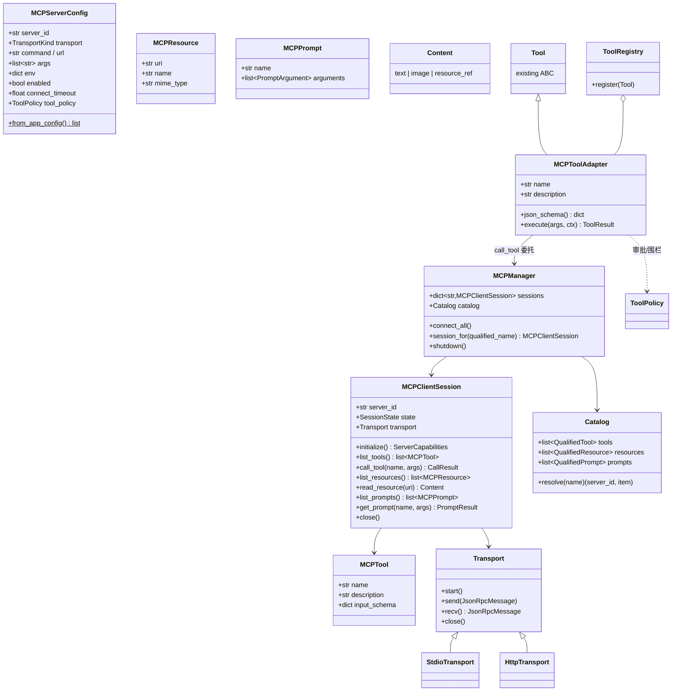
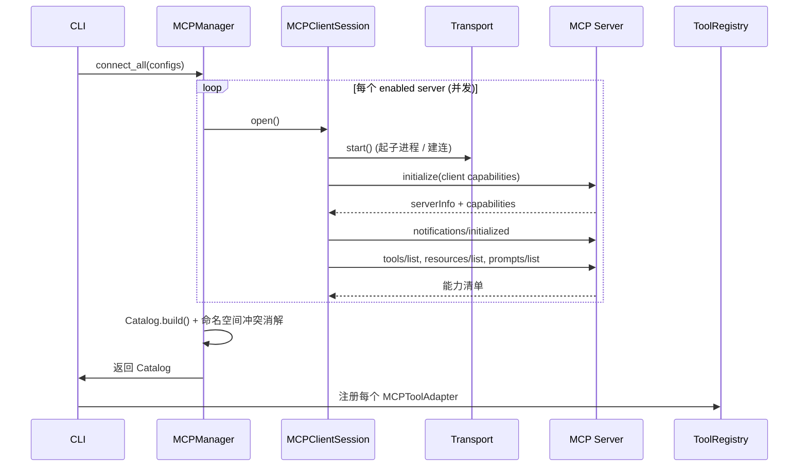

# Model Bridge · MCP 模块架构设计

> 状态：**M0–M7 已全部实现**（见 §6）。ModelBridge 作为 **MCP Client（宿主）** 连接多个
> MCP Server，把远端的 Tool / Resource / Prompt 统一接入现有 agent loop；同时可通过
> `mbridge mcp serve` 反向作为 **MCP Server** 暴露自身能力。
>
> 设计目标：MCP 工具能无缝挂进现有 `ToolRegistry`，agent loop 一行不用改。

---

## 0. 定位与边界

| 维度 | 决策 | 理由 |
|---|---|---|
| 角色 | ModelBridge 是 **MCP Client**，不是 Server | 它是 CLI 宿主，消费外部能力 |
| 集成点 | MCP Tool 适配成现有 `agent.tools.Tool` 子类，注入 `ToolRegistry` | agent loop / provider 层零改动 |
| 协议范围 | 首期 stdio + Streamable HTTP 两种 transport | 覆盖本地进程与远端服务两类主流 server |
| 与国产模型关系 | MCP 层与模型无关，纯能力扩展 | 工具发现/调用不依赖具体 provider |
| 设计原则 | 远端能力默认**不可信**，复用 `PathPolicy`/审批回调思路做二次围栏 | 外部 server 可能返回危险参数/内容 |

---

## 1. 目录结构

```
modelbridge/
└── mcp/
    ├── __init__.py              # 对外门面：connect_servers() / MCPManager 导出
    ├── config.py                # MCPServerConfig dataclass + 从 app config 加载/校验
    ├── errors.py                # MCP 异常体系（见 §4）
    ├── logging.py               # MCP 专用结构化日志（复用 raw_logger 落盘，见 §5）
    │
    ├── protocol/                # 协议层：纯数据 + 编解码，无 IO
    │   ├── __init__.py
    │   ├── messages.py          # JSON-RPC 2.0 请求/响应/通知 dataclass
    │   ├── types.py             # MCPTool / MCPResource / MCPPrompt / Content 数据模型
    │   ├── capabilities.py      # 握手能力协商（server/client capabilities）
    │   └── codec.py             # encode/decode + 协议版本校验
    │
    ├── transport/               # 传输层：字节流 ↔ JSON-RPC frame
    │   ├── __init__.py
    │   ├── base.py              # Transport ABC（start/send/recv/close）
    │   ├── stdio.py             # 子进程 stdio（复用 executor 进程树 kill 经验）
    │   ├── http.py              # Streamable HTTP / SSE
    │   └── factory.py           # 按 config.transport 选择实现（注册表模式）
    │
    ├── session/                 # 会话层：单个 server 的生命周期
    │   ├── __init__.py
    │   ├── client_session.py    # MCPClientSession：握手→列举→调用→关闭
    │   ├── lifecycle.py         # 连接状态机 + 重连/退避策略
    │   └── handshake.py         # initialize / initialized 流程
    │
    ├── manager/                 # 编排层：多 server 统一治理
    │   ├── __init__.py
    │   ├── manager.py           # MCPManager：聚合 N 个 session
    │   ├── catalog.py           # 能力目录（聚合所有 server 的 tool/resource/prompt）
    │   └── naming.py            # 命名空间/冲突消解（server_id 前缀）
    │
    ├── adapters/                # 适配层：MCP 能力 → ModelBridge 既有抽象
    │   ├── __init__.py
    │   ├── tool_adapter.py      # MCPTool → agent.tools.Tool 子类
    │   ├── resource_provider.py # Resource 读取 → prompt builder 可消费的上下文
    │   └── prompt_adapter.py    # MCP Prompt → prompt/ 模块模板
    │
    ├── server/                  # M7：反向 MCP Server（stdio）
    │   ├── __init__.py
    │   ├── server.py            # 协议核心（handle_message 纯函数 + stdio loop）
    │   ├── builtin.py           # chat / list_models / route 三个内置工具
    │   └── __main__.py          # python -m modelbridge.mcp.server
    │
    ├── sampling.py              # M7：sampling/createMessage → 本地模型补全
    └── registry.py              # 把 catalog 注入 ToolRegistry 的胶水 + 热同步
```

**分层依赖（自底向上，单向）**：
`protocol` ← `transport` ← `session` ← `manager` ← `adapters` ← `registry`。
`config` / `errors` / `logging` 为横切，任意层可依赖。

---

## 2. 核心类（类图）



**职责一句话总结**

- `MCPServerConfig`：声明一个 server 怎么连、归谁管、什么策略。
- `Transport`（ABC）：只管字节流 ↔ JSON-RPC frame，不懂语义；`factory` 按配置选实现，沿用 provider `_REGISTRY` 的注册表模式。
- `MCPClientSession`：单 server 的状态机与 RPC 门面（握手/列举/调用/读取）。
- `MCPManager`：多 server 聚合、命名空间、统一启停。
- `Catalog`：能力目录，负责名字解析与冲突消解。
- `MCPToolAdapter`：**关键桥**——`Tool` 的子类，`execute()` 委托给 `MCPManager.call_tool`，从而透明进入现有 agent loop。

---

## 3. 数据流图

### 3.1 启动 / Tool Discovery



### 3.2 Tool Call（融入 agent loop，loop 无感）

```mermaid
sequenceDiagram
    participant Loop as run_agent_turn
    participant Reg as ToolRegistry
    participant Ad as MCPToolAdapter
    participant Pol as ToolPolicy/审批
    participant Mgr as MCPManager
    participant Srv as MCP Server

    Loop->>Reg: dispatch(ToolCall)
    Reg->>Ad: execute(args, AgentContext)
    Ad->>Pol: 检查参数/请求审批 (复用 ctx.confirm)
    alt 拒绝
        Pol-->>Ad: deny
        Ad-->>Loop: ToolResult(is_error=True, 提示)
    else 放行
        Ad->>Mgr: call_tool(qualified_name, args)
        Mgr->>Srv: tools/call
        Srv-->>Mgr: Content[] / isError
        Mgr-->>Ad: CallResult
        Ad->>Ad: Content[] → 文本(+structured)
        Ad-->>Loop: ToolResult
    end
```

### 3.3 Resource & Prompt

```
Resource:  prompt/builder 或 /context 命令
   → MCPManager.read_resource(uri)
   → Content → 注入 system/context 段（受 context/budget 预算裁剪）

Prompt:    用户 /mcp prompt <name>
   → MCPManager.get_prompt(name, args)
   → PromptResult.messages → 作为一轮对话种子注入 Session
```

---

## 4. 错误体系

沿用项目「异常 + `error_hints` 提示」的既有风格，新增独立层次，**不**复用 `ProviderError`
（语义不同：那是模型调用错误，这是工具/协议错误）：

```
MCPError(Exception)                      # 根，带 server_id + hint 字段
├── MCPConfigError                       # 配置非法/缺字段（类比 ConfigError）
├── MCPTransportError                    # 连接失败/进程退出/EOF/超时
│   ├── MCPConnectError
│   └── MCPTimeoutError
├── MCPProtocolError                     # 握手失败/版本不兼容/JSON-RPC 错误码
│   └── MCPVersionMismatch
├── MCPCapabilityError                   # 调了 server 未声明的能力
├── MCPToolError                         # tools/call 返回 isError / schema 不符
└── MCPSecurityError                     # 命中 ToolPolicy 围栏（类比 PathDenied）
```

**关键约定**

- **错误边界与现有一致**：`MCPToolAdapter.execute()` 捕获所有 `MCPError`，转成
  `ToolResult(is_error=True)` 回灌模型——绝不让 agent loop 崩溃（与
  `ToolRegistry.dispatch` 的 `except` 同一哲学）。
- **单 server 故障隔离**：一个 server 连接失败只标记该 session 为 `FAILED`，其余照常工作；
  `Catalog` 跳过失败 server 的能力。
- 每个 `MCPError` 携带中文 `hint`（如「server `xxx` 未声明 tools 能力，请检查 server 版本」），
  经 `error_hints` 风格输出。
- JSON-RPC 标准错误码（-32600 等）在 `protocol.codec` 映射成上述异常。

---

## 5. 日志体系

复用 `raw_logger` 的「落盘 + 脱敏 + 永不因日志崩溃」三原则，新增 MCP 维度：

| 层 | 记录内容 | 落盘位置 |
|---|---|---|
| transport | 原始 JSON-RPC frame（in/out），仅 `--verbose`/debug | `~/.modelbridge/logs/mcp/<server_id>/<ts>_<method>.json` |
| session | 握手结果、能力清单、状态迁移 | 同上，`label=lifecycle` |
| tool call | qualified_name、入参摘要、耗时、isError、Content 摘要 | 结构化行日志 |

**约定**

- **脱敏复用 `_scrub_headers` 思路**：HTTP transport 的 `Authorization`、server `env` 中的
  `*_KEY`/`*_TOKEN`、参数里疑似密钥字段一律 `mask_secret`。
- **关联 ID**：每次 `tools/call` 生成 `correlation_id`，串联 agent loop 的 `ToolCall.id`
  ↔ JSON-RPC `request.id` ↔ 日志，便于复现。
- 默认只记 **元数据 + 摘要**；全量 frame 仅 `--verbose`，与现有 raw 日志一致，避免泄露大 payload。
- 大 Content（图片/二进制 resource）只记 mime + size，不落盘正文。

---

## 6. 演进路线（已全部落地）

| 阶段 | 状态 | 目标 | 关键交付 | 与现有模块的接触 |
|---|---|---|---|---|
| **M0 协议地基** | ✅ | stdio transport + 握手 + `tools/list` | `protocol/`、`transport/stdio`、`session` | 无侵入，纯新增 |
| **M1 Tool Call 打通** | ✅ | `MCPToolAdapter` 注入 `ToolRegistry`，agent 能用 MCP 工具 | `adapters/tool_adapter`、`registry.py` | `ToolRegistry.register` |
| **M2 多 Server + 治理** | ✅ | `MCPManager`、命名空间、故障隔离、`mbridge mcp` CLI 子命令 | `manager/`、`config.py`、`doctor` 体检集成 | `cli.py`、`doctor.py` |
| **M3 Resource & Prompt** | ✅ | resource 注入上下文、prompt 模板接入 | `resource_provider`、`prompt_adapter` | `prompt/`、`context/budget` |
| **M4 HTTP transport** | ✅ | Streamable HTTP（POST + SSE、`Mcp-Session-Id`、GET 监听流） | `transport/http` | 复用 factory；`headers` 配置携带鉴权 |
| **M5 健壮性** | ✅ | 重连退避（`ReconnectPolicy`）、`ping` 心跳、`list_changed` 热刷新 + ToolRegistry 自动同步 | `session/lifecycle`、`manager`、`registry.sync_mcp_tools` | `ToolRegistry.unregister` |
| **M6 Agent 深度集成** | ✅ | REPL `/mcp` 控制台（list/tools/on/off/refresh/read/prompt）、`tool_overrides` 工具级权限、router `wants_mcp` 能力感知 | `agent/commands.py`、`config.py` | `router/`、`agent/` |
| **M7 Server 模式** | ✅ | `mbridge mcp serve` 反向暴露 chat/list_models/route；sampling 回调让 server 借用国产模型（默认关闭，配置开启） | `mcp/server/`、`mcp/sampling.py` | `client.py`/`providers` |

### 6.1 配置参考（全量）

```yaml
mcp:
  enabled: true
  reconnect_attempts: 2      # 传输层断开后的重连次数（指数退避）
  reconnect_backoff: 0.5     # 退避基数（秒）：0.5, 1, 2, … 封顶 8s
  heartbeat_interval: 0      # >0 时后台 ping 保活并自动重连
  sampling:                  # M7：允许 server 借用本地配置的模型
    enabled: false           # 默认关闭（安全姿态）
    model: null              # 缺省用 default_model
    max_tokens: 2048         # 硬上限，server 要多少都不会超过
  servers:
    - id: filesystem         # stdio：本地子进程
      transport: stdio
      command: npx
      args: ['-y', '@modelcontextprotocol/server-filesystem', '.']
      tool_policy: approve   # auto | approve | deny
      tool_overrides:        # M6：工具级覆盖，比 tool_policy 更细
        delete_file: deny
        read_file: auto
    - id: remote             # http：Streamable HTTP 远端
      transport: http
      url: https://example.com/mcp
      headers: {Authorization: 'Bearer ...'}   # 日志自动脱敏
```

### 6.2 反向 Server（M7）

在 Claude Desktop / Cursor 等 MCP host 中配置 `command: mbridge, args: [mcp, serve]`，
即可把 ModelBridge 的 `chat`（国产模型补全）、`list_models`、`route`（任务分级）
作为 MCP 工具暴露出去——host 不接触任何 API key。

---

## 7. 风险分析

| 风险 | 等级 | 说明 | 缓解 |
|---|---|---|---|
| **远端工具不可信** | 高 | server 可返回危险参数（路径穿越、危险命令）或注入式内容 | `ToolPolicy` 二次围栏 + 复用 `ctx.confirm` 审批；MCP 文件类工具结果仍过 `PathPolicy`；内容默认当不可信文本 |
| **Prompt 注入** | 高 | resource/tool 返回内容含「忽略上述指令」类攻击 | resource 内容明确包裹为数据段、与系统指令物理隔离；不自动执行其中的指令 |
| **Windows 子进程坑** | 高 | stdio server 子进程超时/僵死、进程树残留（项目已有此坑记录） | `transport/stdio` 复用 executor 的 Popen + 进程树 kill；连接/调用双超时 |
| **协议版本碎片** | 中 | MCP 规范仍在演进，server 版本不一 | `capabilities` 协商 + `MCPVersionMismatch` 显式报错；只用协商后的交集能力 |
| **工具命名冲突** | 中 | 多 server 同名 tool 撞车，模型选错 | `Catalog` 强制 `server_id__tool` 命名空间；冲突时日志告警 |
| **能力膨胀拖累模型** | 中 | N 个 server 上百工具塞进 schema，挤占上下文、降低选择准确率 | 按 server/任务白名单启用；M6 让 router 按需注入；`context/budget` 裁剪 resource |
| **单 server 拖垮整体** | 中 | 某 server 慢/挂导致启动阻塞 | 并发连接 + per-server 超时 + 故障隔离（不影响其余） |
| **密钥泄露** | 中 | server env / HTTP 头含密钥被记进日志 | 复用 `mask_secret`/`_scrub_headers` 脱敏；env 不全量落盘 |
| **资源泄漏** | 低 | 子进程/连接未回收 | `MCPManager.shutdown()` 统一关闭；CLI 退出钩子兜底 |
| **同步 vs 异步阻抗** | 低-中 | 现有 agent loop 是同步的，MCP/HTTP 偏异步 | session 层封装为同步阻塞接口（内部可线程/事件循环隔离），对上保持同步，避免 loop 改造 |

---

*本文件最初为纯架构设计；M0–M7 现已全部落地，§6 反映实现现状。*
